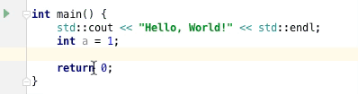

# CLion Postfix Completion

# Usage

- press <kbd>enter</kbd> or <kbd>tab</kbd>
- or `a.cout` then press <kbd>tab</kbd>

## Supported
- cout
- coutln (with `std::endl`)
- printf
- printfln (with `"\n"`)
- or just type part of them~

# Development
change `local` property to your `CLion` path in `gradle.properties` file